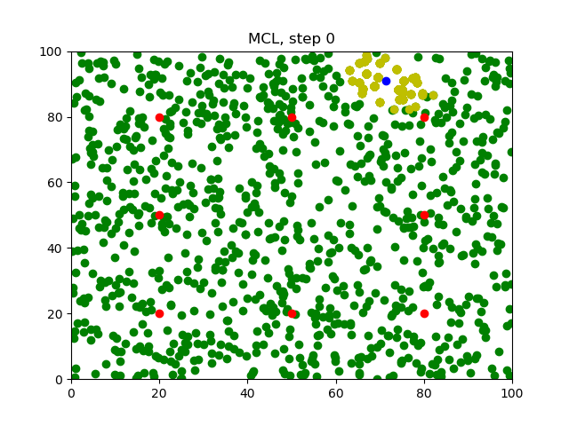
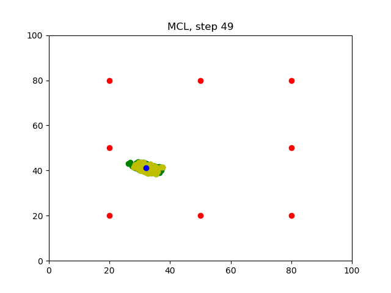

[](https://www.udacity.com/robotics)

# RoboND-MCL-Lab
C++ implementation of Monte Carlo Localization for RoboND

### Compiling the Program

Clone this repository. Open terminal in cloned directory and write:

```sh
$ g++ robot.cpp -o app -std=c++11 -I/usr/include/python2.7 -lpython2.7
```

### Running the Program
Before you run the program, make sure the `Images` folder is empty!
```sh
$ ./app
```
Wait for the program to iterate `50` times.

### Generated Images
After running the program, `50` images will be generated in the `Images` folder.
#### Step0

#### Step49

